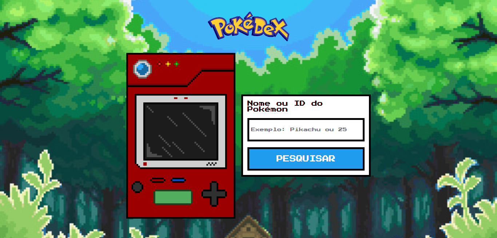

<h1 align="center">Pokédex Simple</h1>

Aplicação desenvolvida com objetivo de por em prática fundamentos WEB, e o uso do fetch para consumir uma API.

  <a href="#rocket-tecnologias">Tecnologias</a>&nbsp;&nbsp;&nbsp;|&nbsp;&nbsp;&nbsp;
  <a href="#art-assets">Assets</a>&nbsp;&nbsp;&nbsp;|&nbsp;&nbsp;&nbsp;
  <a href="#computer-projeto">Projeto</a>

  

## :rocket: Tecnologias

Esse projeto foi desenvolvido com as seguintes tecnologias:

- HTML e CSS
- JavaScript
- Git e Github
- Pixilart

## :art: Assets

Assets usados no projeto.

- [Pokédex Kanto em pixel art](https://www.pixilart.com/art/pokdex-kanto-sr2ba35c1012772)

## :computer: Projeto

O Pokédex Simple é uma aplicação onde você pode "simular" uma Pokédex, buscando pelo nome ou id do Pokémon.

- [Acesse o projeto finalizado, online](https://joaoalvesxp.github.io/pokedex-simple)

---

Feito com ♥ by joaoalvesxp